# Extraction & Evaluation Workflow Diagram

Polished block diagram with explicit inputs, processing stages, and outputs.

```mermaid
flowchart LR
    %% Direction
    classDef input fill:#f0f9ff,stroke:#0284c7,stroke-width:1px,color:#0c4a6e
    classDef process fill:#eef2ff,stroke:#4338ca,stroke-width:1px,color:#312e81
    classDef output fill:#ecfdf5,stroke:#059669,stroke-width:1px,color:#065f46
    classDef store fill:#fff7ed,stroke:#c2410c,stroke-width:1px,color:#7c2d12
    classDef warn fill:#fef2f2,stroke:#dc2626,color:#7f1d1d
    classDef loop fill:#f5f3ff,stroke:#7e22ce,color:#581c87,stroke-dasharray: 5 3

    %% 1. Inputs
    PDFs[("PDF Permits\n(data/**) ")]:::input
    GTCSV[("Ground Truth CSV\n(data/01_benchmark/eadeies_final.csv)")]:::input

    %% 2. Extraction Engines
    subgraph S1[1. Raw Text Extraction]
        direction TB
        EXTRACT["compare_pdf_extractors.py\n(dual engine run)"]:::process
        PDFs --> EXTRACT
        EXTRACT --> PTXT["*_pdfplumber.txt"]:::store
        EXTRACT --> DTXT["*_docling.txt"]:::store
        EXTRACT --> COMPJSON["*_compare.json"]:::output
        EXTRACT --> AGGJSON["_aggregate_summary.json"]:::output
    end

    %% 3. Structured Parsing
    subgraph S2[2. Structured Parsing]
        direction TB
        PARSE["build_structured_json.py\n(parse KAEK / Owners / Coverage)"]:::process
        PTXT --> PARSE
        DTXT --> PARSE
        PARSE --> SJ1["<stem>_pdfplumber_structured.json"]:::store
        PARSE --> SJ2["<stem>_docling_structured.json"]:::store
    end

    SJ1 --> SJDIR["structured_json dir"]:::store
    SJ2 --> SJDIR

    %% 4. Evaluation
    subgraph S3[3. Benchmark Evaluation]
        direction TB
        EVAL["benchmark_evaluation.py\n(owners / kaek / coverage metrics)"]:::process
        SJDIR --> EVAL
        GTCSV --> EVAL
        EVAL --> BREPORT["benchmark_report.json"]:::output
    end

    %% 5. Excel Reporting
    subgraph S4[4. Reporting]
        direction TB
        EXCEL["build_excel_comparison.py\n(build 5 sheets)"]:::process
        SJDIR --> EXCEL
        GTCSV --> EXCEL
        EXCEL --> XLSX["benchmark_side_by_side.xlsx\n(KAEK / Owners / Coverage / Wide / Mismatches)"]:::output
    end

    %% 6. Feedback Loop
    subgraph S5[5. Iterative Refinement]
        direction TB
        INSIGHTS["Manual Review + Metrics Insights"]:::loop
        HEUR["Heuristic Updates\n(parse_eu_number, KAEK suffix, owner parsing)"]:::process
        TESTS["Tests (pytest)\n(test_parsing.py)"]:::process
        INSIGHTS --> HEUR --> TESTS --> PARSE
    end

    BREPORT --> INSIGHTS
    XLSX --> INSIGHTS

    %% Optional failure marker
    ERRDOC["docling optional\n(not installed)"]:::warn
    EXTRACT --> ERRDOC
```

## Legend
| Style | Meaning |
|-------|---------|
| Blue Input | External/source data |
| Purple Process | Active transformation / computation |
| Beige Store | Intermediate persisted artifacts |
| Green Output | Final consumable reports / structured data |
| Dashed Loop | Continuous improvement cycle |
| Red Warn | Optional / potential failure path |

## Stages Summary
1. Raw text extraction for both engines (timings & similarity stats).
2. Parsing into canonical structured JSON (KAEK, Owners, Coverage groups).
3. Evaluation vs ground-truth CSV (precision/recall/F1, coverage accuracy, MAE/RMSE).
4. Excel synthesis for visual QA; mismatch isolation.
5. Feedback loop to refine heuristics & expand tests.

## Key Refinable Heuristics
- `parse_eu_number` thousands vs decimal disambiguation.
- Fragmented KAEK suffix reconstruction (`/0/0`).
- Owner line stitching & markdown table header detection.
- Coverage row detection and negative value handling.

---
For deeper parsing rationale see `EXTRACTION_LOGIC.md`.
